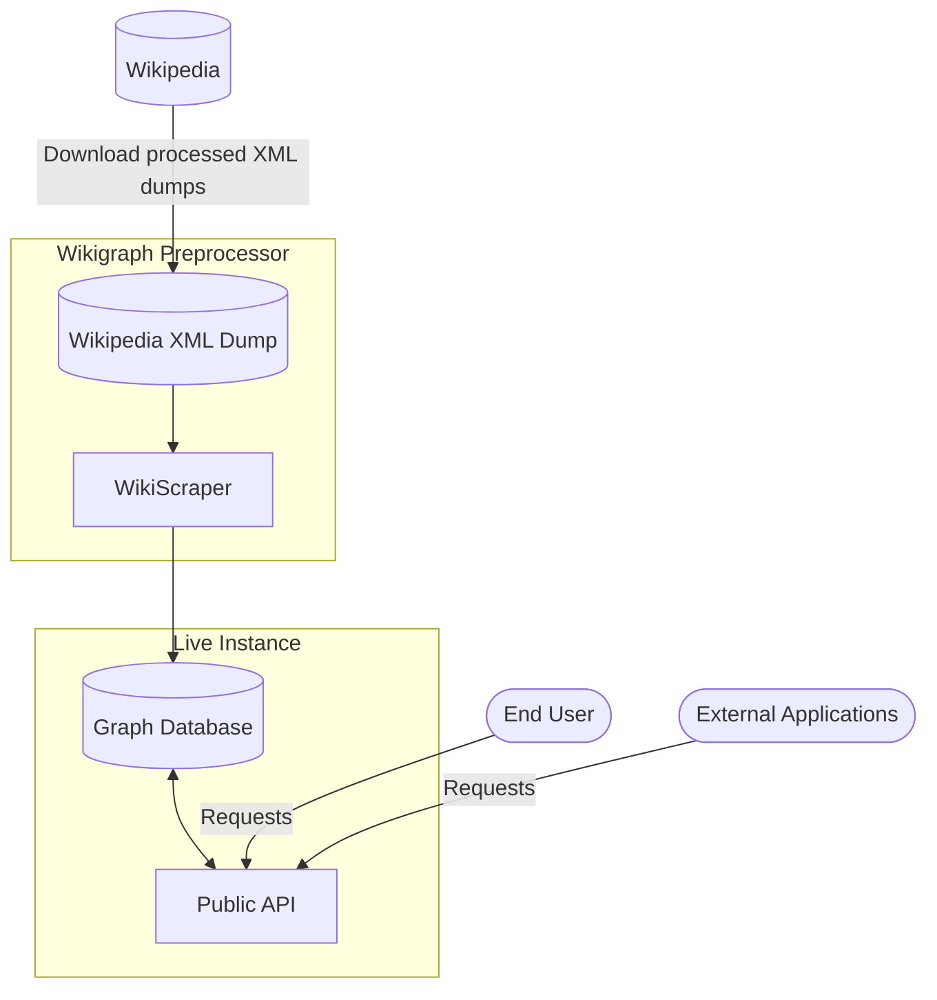

# Wikigraph: Mapping Wikipedia
Wikigraph is a project intended to map how Wikipedia pages are linked together.

## Architecture

```mermaid
graph
    subgraph PP[Wikigraph Preprocessor]
        direction LR
        WPDUMP[(Wikipedia XML Dump)]
        WPSCR[WikiScraper]
    end
    subgraph LI[Live Instance]
        direction LR
        GDB[(Graph Database)]
        API[Public API]
    end
    WP[(Wikipedia)]
    USER([End User])
    XAPPS([External Applications])
    
    WP -->|Download processed XML dumps| WPDUMP
    WPDUMP --> WPSCR
    WPSCR --> GDB
    GDB <--> API
    USER & XAPPS -->|Requests| API
```